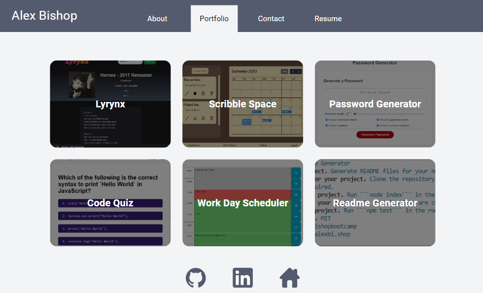

# React Portfolio

[](https://opensource.org/licenses/MIT)

## Description

A simple portfolio page written in React

## Table of Contents

* [Installation](#installation)
* [Usage](#usage)
* [License](#license)
* [Questions](#questions)

## Installation

Clone the repository and run ```npm install``` in the root directory.

## Usage

Run ```npm run build``` in the root directory. This will build the site into the ```/dist``` directory.

Run ```npm run dev``` to host it in a dev server with Vite.

[View the page here](https://alexbishopreactportfolip.netlify.app/portfolio)

Preview image:



## License

This project uses the [MIT](https://opensource.org/licenses/MIT) license.


## Questions

If you have any questions, please contact me at [github@alexbi.shop](mailto:github@alexbi.shop).

You can also find me on [Github](https://github.com/alexbishopbootcamp).
